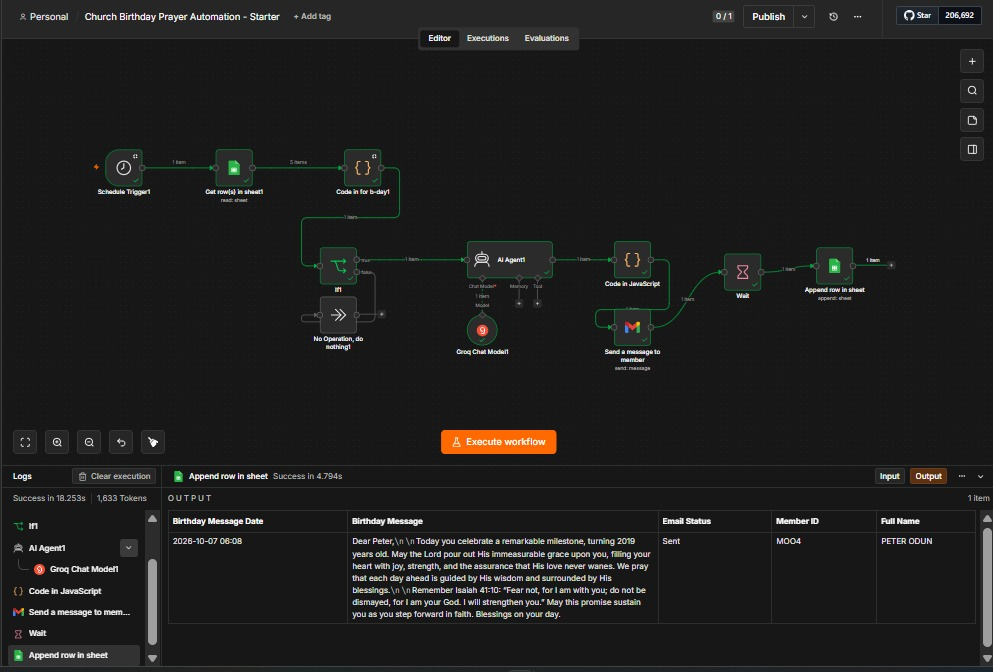

# Church Birthday Prayer Automation (n8n)

An automated n8n workflow that sends personalized, AI-generated birthday emails (prayers & blessings) to church members on their special day.

Built for **Hope Center Church** – Excellent Men department.



---

## What It Does

Every day at **5:00 AM (Africa/Lagos)**:

1. Reads the master member list from Google Sheets
2. Filters for **male members** whose birthday is today and who have not already received a message today
3. Uses an AI agent (Groq) to write a fresh, personalized birthday prayer / blessing
4. Formats the message into a beautiful HTML email
5. Sends the email via Gmail
6. Logs the message + delivery status into a tracking sheet

---

## Features

- Timezone-aware birthday detection (`Africa/Lagos`)
- Supports multiple date formats (`YYYY-MM-DD`, `DD/MM/YYYY`, `DD-MM-YYYY`)
- Email cleaning (common Gmail typos)
- Prevents duplicate messages on the same day
- AI-generated unique messages every time (5 rotating styles)
- Professional HTML email template with church branding
- Full audit log of every message sent

---

## Tech Stack

| Component          | Tool / Service              |
|--------------------|-----------------------------|
| Workflow Engine    | n8n                         |
| AI Message Writer  | Groq (`openai/gpt-oss-20b`) |
| Member Database    | Google Sheets               |
| Email Delivery     | Gmail (OAuth2)              |
| Scheduling         | n8n Schedule Trigger        |

---

## Repository Structure

```
.
├── README.md
├── .gitignore
├── church-birthday-prayer-automation.json   # Sanitized n8n workflow (import this)
└── docs/
    └── workflow-screenshot.jpeg             # Screenshot of the working workflow
```

---

## Prerequisites

- A running **n8n** instance (self-hosted or cloud)
- Google account with access to the member spreadsheet
- Gmail account for sending emails (OAuth2)
- Groq API key

---

## Google Sheets Setup

### 1. Master Member Sheet (`master sheet meber`)

Required columns:

| Column Name              | Description                          | Example              |
|--------------------------|--------------------------------------|----------------------|
| `Member ID`              | Unique ID                            | `M001`               |
| `Full Name`              | Full name of member                  | `John Doe`           |
| `Role/Title`             | Title used in greeting               | `Bro.` / `Deacon`    |
| `Gender`                 | Must be `Male` (case-insensitive)    | `Male`               |
| `Date of Birth`          | Birthday (year is used for age)      | `1990-05-15`         |
| `Email`                  | Recipient email                      | `john@example.com`   |
| `WhatsApp`               | (Optional)                           | `+234...`            |
| `Birthday Message Date`  | Last time a message was sent         | `2025-05-15`         |

### 2. Log Sheet (`email received`)

The workflow appends a new row for every message sent with:

- Birthday Message Date
- Member ID
- Full Name
- Birthday Message (full AI text)
- Email Status (`Sent` / `Failed`)

---

## Installation & Setup

### 1. Import the Workflow

1. Open your n8n instance
2. Go to **Workflows → Import from File**
3. Select `church-birthday-prayer-automation.json`
4. The workflow will appear (inactive)

### 2. Configure Credentials

You will need to create / select these credentials inside n8n:

| Node                     | Credential Type          | Notes                              |
|--------------------------|--------------------------|------------------------------------|
| Get row(s) in sheet1     | Google Sheets OAuth2     | Same Google account as the sheet   |
| Append row in sheet      | Google Sheets OAuth2     | Same as above                      |
| Send a message to member | Gmail OAuth2             | The sending email address          |
| Groq Chat Model1         | Groq API                 | Get key from https://console.groq.com |

### 3. Update Sheet IDs (if needed)

After import, open these two Google Sheets nodes and point them to **your** spreadsheet:

- Document ID
- Sheet / Tab name

### 4. (Optional) Customize the AI Prompt

The AI Agent node contains a carefully crafted system prompt that:

- Forces 3 short paragraphs
- Uses the member’s Title + First Name
- Mentions the age they are turning
- Rotates between 5 different styles (prayer, scripture, joyful, encouraging, thankful)
- Keeps the tone professional, warm and prayerful

Feel free to edit the system message to match your church’s voice.

### 5. Activate the Workflow

Once credentials and sheet IDs are set, toggle the workflow to **Active**.

It will run every day at 5:00 AM Lagos time.

---

## How the Filtering Works

The Code node (`Code in for b-day1`) does the following:

1. Gets today’s date in `Africa/Lagos`
2. Parses `Date of Birth` (supports 3 formats)
3. Keeps only members where:
   - `Gender` = male
   - Month + Day match today
   - `Birthday Message Date` is **not** today (prevents duplicates)
4. Cleans the email address
5. Passes clean data downstream

---

## Email Template

The HTML email includes:

- Navy header with birthday emoji
- AI-generated body (3 paragraphs)
- Closing from **Excellent Men – Hope Center Church**
- Footer with church name

You can fully customize the HTML in the `Code in JavaScript` node.

---

## Security Notes

- This repository contains **no real credentials**, API keys, or personal data.
- The workflow JSON has been sanitized (credential IDs replaced with placeholders).
- Never commit `.env` files, credential JSON exports, or real member spreadsheets.
- Use n8n’s built-in credential store.

---

## License

MIT – feel free to use and adapt for your church or organization.

---

## Author

**Olu Favour**  
Data Analyst & AI Automation Engineer  
[Portfolio](https://tolu-portfolio-hazel.vercel.app/) · [GitHub](https://github.com/Olufavour18)

---

*Built with love for Hope Center Church*
